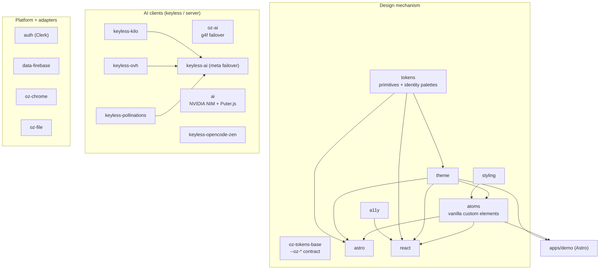

# @chirag127/design-system

> Framework-agnostic design tokens, themes, atomic web components, a11y primitives, and keyless AI clients — one pnpm monorepo, a distinct look per site.

[](LICENSE)
[](https://github.com/chirag127/design-system/stargazers)
[](https://github.com/chirag127/design-system/commits)
[](https://www.typescriptlang.org/)
[](https://pnpm.io/)

## What it is / why it exists

The `@chirag127/*` monorepo powering ~80 [oriz](https://blog.oriz.in) sites. It ships **shared mechanism, never a shared look**: a CSS custom-property token contract, ready-made themes, framework-agnostic atomic web components, accessibility primitives, and a set of keyless AI clients. Every site reuses the tokens/atoms/a11y and then overrides `--oz-*` with its **own** palette, type, and motion — so nothing looks like the demo.

Each package is independently publishable, zero-runtime-dependency where practical, and usable without a framework (Astro, Next, Vue, Svelte, or plain HTML).

## Links

- **GitHub Pages:** <https://chirag127.github.io/design-system/>
- **Repo:** <https://github.com/chirag127/design-system>

⭐ If this is useful, please star the repo — it helps others find it.

## Package graph



Edges are real `@chirag127/*` dependencies from each package's `package.json`. `oz-tokens-base` is the shared contract; `tokens → theme/styling → atoms → astro/react` is the styling chain; `keyless-*` roll up into `keyless-ai`; the demo app consumes `atoms` + `theme`.

## Package catalogue

### Design mechanism

| Package | What it does |
| --- | --- |
| `@chirag127/oz-tokens-base` | The `--oz-*` CSS custom-property **contract** (color roles, space, radii, fonts, motion) + a11y focus ring. Pure CSS. |
| `@chirag127/tokens` | Design tokens: shared primitives + per-archetype identity palettes (editorial, marketing, dashboard, docs). |
| `@chirag127/theme` | Ready-to-use themes built on `tokens`; pick an archetype, atoms follow. |
| `@chirag127/styling` | Modern CSS reset, prose styles, utility classes — token-aware. |
| `@chirag127/atoms` | Framework-agnostic atomic web components (buttons, chips, cards, badges, fields, nav, prose). Vanilla custom elements, zero deps. |
| `@chirag127/a11y` | Accessibility primitives: focus-trap, roving-tabindex, ARIA helpers. Zero deps. |
| `@chirag127/astro` | Astro integration + component wrappers (injects tokens/theme/atoms). |
| `@chirag127/react` | Typed React wrappers over atoms; re-exports a11y utils. |

### AI clients

| Package | What it does |
| --- | --- |
| `@chirag127/oz-ai` | Client-side fleet AI — wraps g4f with multi-provider failover (auto-router → DeepInfra → Puter). chat/complete/vision/image, streaming. No key. |
| `@chirag127/ai` | One interface, two backends: server NVIDIA NIM (key from env, server-only) + client Puter.js (keyless). |
| `@chirag127/keyless-ai` | Keyless failover meta-client: kilo → ovh → pollinations, first success wins. No key. |
| `@chirag127/keyless-kilo` | Keyless Kilo Gateway client (OpenAI-compatible). |
| `@chirag127/keyless-ovh` | Keyless OVHcloud AI Endpoints client. |
| `@chirag127/keyless-pollinations` | Keyless Pollinations text client. |
| `@chirag127/keyless-opencode-zen` | Keyless OpenCode Zen client (free models). |

### Platform + adapters

| Package | What it does |
| --- | --- |
| `@chirag127/auth` | Clerk auth adapter — `ClerkProvider` wrapper, sign-in/out, `useOrizAuth` hook. Unstyled, themed per site. |
| `@chirag127/data-firebase` | Thin Firestore adapter for small user-data; env-driven init, `getDoc`/`setDoc`/`onSnapshot`. |
| `@chirag127/oz-chrome` | Shared Astro chrome (wordmark, header/footer, accessible tool-page shell), themed via `--oz-*`. |
| `@chirag127/oz-file` | Browser file helpers: FileReader promises, Blob download, drag-drop, print-to-PDF. Zero deps. |

## Identities (distinct looks, one component set)

| Identity | For | Accent | Display font |
| --- | --- | --- | --- |
| `editorial` | Blogs, long-form, magazines | International Orange | Source Serif 4 |
| `marketing` | SaaS landing pages | Violet-Indigo | Inter Tight |
| `dashboard` | Apps, analytics | Blue | Inter |
| `docs` | Documentation sites | Teal | Inter |

Same markup, completely different look — swap the theme CSS and atoms follow.

## Tech stack

- **TypeScript** + **pnpm workspace** (`pnpm@10.34.3`, Node `>=22.12`)
- Build: `tsup`; lint/format: **Biome**; releases via GitHub Actions
- CSS custom properties (framework-neutral); vanilla custom elements for atoms
- Adapters for Astro + React; AI clients target Node + browser (`fetch`)

## Repo structure

```
design-system/
├── packages/
│   ├── oz-tokens-base/  tokens/  theme/  styling/   # token contract + styling chain
│   ├── atoms/  a11y/  astro/  react/                # components + adapters
│   ├── oz-ai/  ai/  keyless-*/                       # AI clients
│   └── auth/  data-firebase/  oz-chrome/  oz-file/   # platform adapters
├── apps/
│   └── demo/            # Astro demo — proves identical atoms take different identities
├── pnpm-workspace.yaml
├── biome.json
└── package.json
```

## Quick start

### Dev setup

```sh
pnpm install          # installs all packages + demo app
pnpm run build        # builds packages/*
pnpm run demo:dev     # Astro demo at localhost:4321
pnpm run lint         # biome check
```

### Consume a package — plain HTML

```html
<link rel="stylesheet" href="https://cdn.jsdelivr.net/npm/@chirag127/theme/src/editorial.css" />
<link rel="stylesheet" href="https://cdn.jsdelivr.net/npm/@chirag127/atoms/src/styles.css" />
<script type="module" src="https://cdn.jsdelivr.net/npm/@chirag127/atoms/src/index.js"></script>
<oz-button variant="primary">Hello</oz-button>
```

### npm / React

```sh
npm i @chirag127/tokens @chirag127/theme @chirag127/atoms @chirag127/react
```

```tsx
import '@chirag127/theme/marketing.css'
import '@chirag127/atoms/styles.css'
import '@chirag127/atoms'
import { Button, Card } from '@chirag127/react'
```

### Astro

```js
// astro.config.mjs
import oz from '@chirag127/astro'
export default defineConfig({ integrations: [oz({ identity: 'editorial' })] })
```

### Light / dark

```html
<script type="module" src="@chirag127/theme/theme.js"></script>
<button onclick="ozTheme.cycle()">Toggle theme</button>
```

`window.ozTheme = { get(), set('light'|'dark'|'auto'), cycle(), apply() }` — persists to `localStorage`; `data-oz-theme` on `<html>` forces a mode.

## Token contract

Every component reads the same `--oz-*` variables. Provide your identity by setting them:

```css
:root {
  --oz-paper: …; --oz-paper-2: …; --oz-ink: …; --oz-ink-mute: …;
  --oz-rule: …;  --oz-accent: …;  --oz-accent-soft: …; --oz-accent-fg: …;
  --oz-success: …; --oz-danger: …;
  --oz-font-display: …; --oz-font-body: …; --oz-font-mono: …;
}
```

## Configuration

Env vars are consumed by the platform/AI packages (names + purpose only — never commit values):

| Variable | Purpose |
| --- | --- |
| `NVIDIA_API_KEY` | `@chirag127/ai` server backend (NVIDIA NIM) — server-side only |
| `PUBLIC_CLERK_PUBLISHABLE_KEY` | `@chirag127/auth` Clerk publishable key (client-safe) |
| `CLERK_SECRET_KEY` | Clerk secret — server/deploy only, never `PUBLIC_*` |
| `PUBLIC_FIREBASE_*` | `@chirag127/data-firebase` client config (client-safe) |
| `NPM_TOKEN` | Publish auth for the release workflow (CI only) |

The keyless AI packages (`oz-ai`, `keyless-*`) require **no** keys. No secrets in the repo; `PUBLIC_*` is client-only.

## Publishing

See [`.github/workflows/release.yml`](.github/workflows/release.yml). Push a `v*` tag to publish packages to npm (with provenance) + GitHub Packages.

```sh
git tag v0.2.0 && git push origin v0.2.0
```

## Part of the oriz family

The design + AI foundation for the ~80-site [oriz](https://blog.oriz.in) family. `@chirag127/*` gives every site the same mechanism (tokens, atoms, a11y, keyless AI) while each site earns its own identity.

## Contributing

Reuse mechanism; never bake a site's brand skin into an atomic package. Conventional commits are the changelog.

## License

MIT — see [LICENSE](LICENSE).

## Author

Chirag Singhal · <chirag@oriz.in> · [@chirag127](https://github.com/chirag127)

## Status

Active (`v0.2.0`). Roadmap: more atoms, Vue/Svelte adapters, expanded keyless-provider pool.
